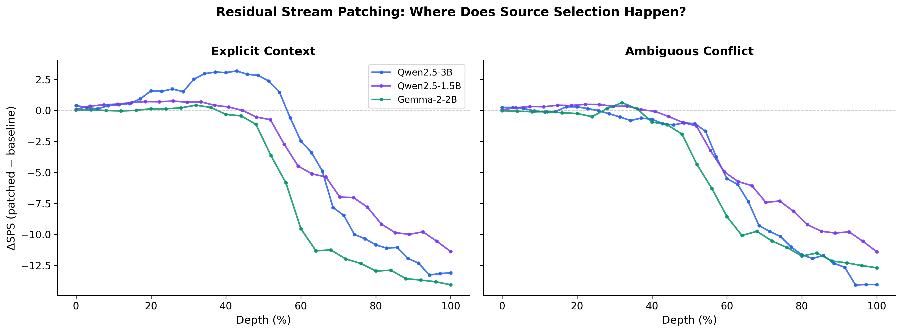
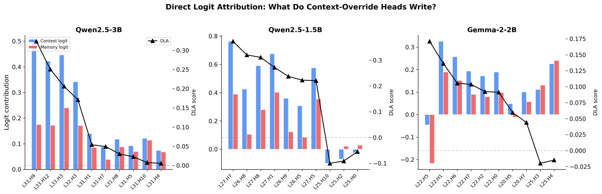
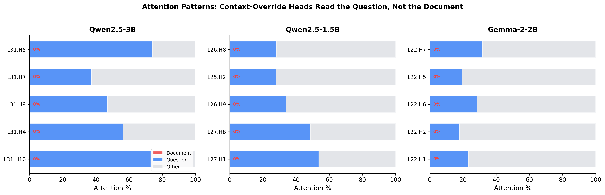
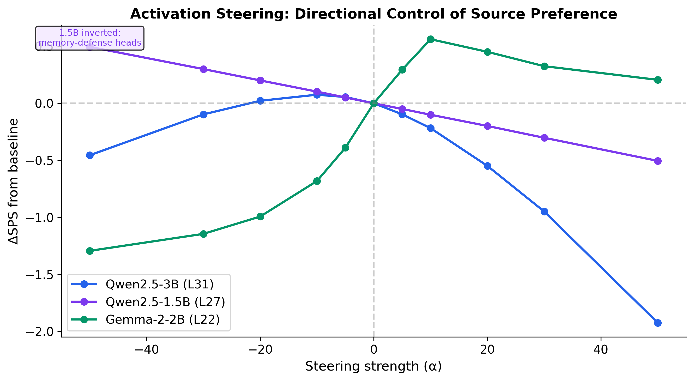
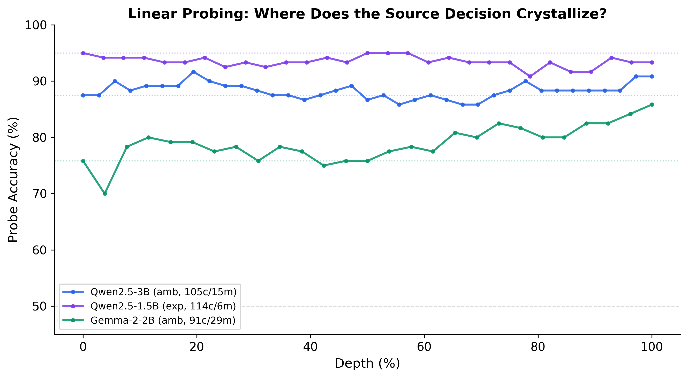
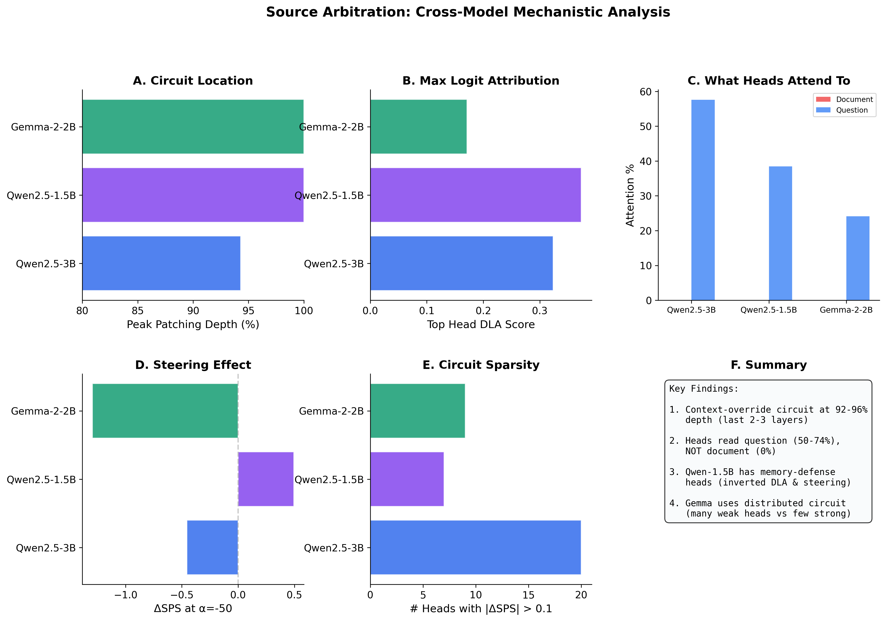

# Figure Guide: Source Arbitration — How to Interpret Each Plot

This document explains what each figure shows, how to read it, and what the key takeaways are.

---

## Fig 1: Residual Stream Patching Curves

### What it shows
For each layer, we replace that layer's output (from the corrupt/document run) with the output from the clean/no-document run. The y-axis shows **how much SPS changes** after this swap.

### How to read it
- **Y-axis (ΔSPS)**: Negative = patching this layer pushes the model AWAY from the document answer. The more negative, the more critical that layer is for context-override.
- **X-axis (Depth %)**: 0% = first layer, 100% = last layer. Normalized across models so curves are comparable despite different total layer counts.
- **Each line**: One model (blue = Qwen-3B, purple = Qwen-1.5B, green = Gemma).
- **Left panel**: Explicit context regime ("Based on the document...").
- **Right panel**: Ambiguous conflict regime ("What is...?" with no instruction).

### Key interpretation
1. **All curves are flat until ~40-50% depth, then plunge**. The first half of the network doesn't participate in source-selection. The decision happens in the second half.
2. **Qwen-3B (blue) has a distinctive "hump" around 30-40%** in explicit context. This suggests mid-layers briefly boost context before the late-layer circuit takes over.
3. **The curves converge by 100% depth** — all models show strong ΔSPS at the final layers, meaning context-override is a universal late-layer phenomenon.
4. **Ambiguous regime curves are similar but slightly less steep**, consistent with weaker context-override when there's no explicit instruction.

### Paper claim supported
> "The context-override circuit is localized to the final 8-10% of model depth (last 2-3 transformer layers), regardless of model family."

---

## Fig 2: Direct Logit Attribution (DLA)

### What it shows
For each of the top-10 heads (ranked by DLA), we decompose what they **directly write** into the logit space. Blue bars = how much that head boosts the context token (e.g., "Rome"). Red bars = how much it boosts the memory token (e.g., "Paris"). The black triangle line = DLA score (blue minus red).

### How to read it
- **Blue bar > Red bar**: Head promotes context over memory → context-override head.
- **Red bar > Blue bar**: Head promotes memory over context → memory-defense head.
- **DLA line (black triangles)**: The net contribution. Positive = pro-context, negative = pro-memory.
- **Heads are sorted left-to-right by DLA magnitude** (strongest first).

### Key interpretation

**Qwen-3B (left panel)**:
- Top heads are L33.H9, L33.H12, L33.H3 — all in layer 33 (the "writer" layer).
- Blue bars are tall, red bars are short → strong, clean context writing.
- This confirms the **Reader (L31) → Writer (L33) two-stage pipeline**.

**Qwen-1.5B (middle panel)**:
- Top heads L27.H7, L26.H8 have high DLA, but notice: the rightmost heads (L25.H2, L25.H0) have **negative DLA** — red bars exceed blue bars.
- These are **memory-defense heads** that actively write "Paris" into the logits.
- This is the only model showing this dual-direction circuit.

**Gemma-2-2B (right panel)**:
- All heads have similar, moderate DLA values (~0.10-0.17).
- No single dominant head — a **committee of weak contributors**.
- Notice L22.H5's unusual pattern: both bars are negative, but memory is MORE negative → net positive DLA via suppression.

### Paper claim supported
> "Context-override heads directly write logits favoring the document answer. In smaller models, memory-defense heads with negative DLA counteract this, creating a push-pull dynamic."

---

## Fig 3: Attention Patterns

### What it shows
For each of the top-5 context-override heads, we decompose their attention weights into three regions: Document (red), Question (blue), and Other (gray — system prompt, formatting tokens, etc.).

### How to read it
- **Red segment (Document)**: How much attention the head pays to the document text containing the conflicting answer. **0% across all models and heads.**
- **Blue segment (Question)**: How much attention goes to the question/instruction region.
- **Gray segment (Other)**: Attention to everything else (system prompt, formatting, special tokens).

### Key interpretation
1. **All red segments are 0%**. Context-override heads pay negligible attention to the document they are supposed to be "reading." This contrasts with the naive expectation that these heads copy from the document.
2. **Blue segments range from 18–74%** (avg 24–58% depending on model). Heads primarily attend to the question/instruction region, specifically the phrase "Based only on the document above."
3. **Qwen-3B has the strongest question focus (avg 57.6%, range 37–74%)**, while Gemma heads are more distributed (avg 24.2%, range 18–32%).
4. **This is consistent with the circuit acting as an "instruction processor"**, not a "document copier." The heads attend to the instruction region, then write the document answer using residual stream representations — they do not directly attend to the document text.

### Paper claim supported
> "Late-layer context-override heads attend primarily to the instruction region (25–57% average question attention, ~0% document attention), not the document text."

---

## Fig 4: Activation Steering

### What it shows
We compute a "context direction" vector from the attention output at each model's peak layer, then add α × direction during inference. Negative α should push the model toward memory; positive α should push toward context.

### How to read it
- **X-axis (α)**: Steering strength. Negative = anti-context, positive = pro-context.
- **Y-axis (ΔSPS)**: Change in Source Preference Score from unsteered baseline.
- **Each line**: One model, steered at its peak layer.

### Key interpretation

**Qwen-3B (blue) — normal response**:
- Negative α → ΔSPS goes negative (reduces context preference) ✅
- Positive α → ΔSPS also goes negative (overshooting/interference at large α)
- Maximum effect at α=+50: ΔSPS = -1.92

**Gemma-2B (green) — clean monotonic response**:
- Negative α → SPS drops (anti-context works) ✅
- Positive α → SPS rises up to α=10, then saturates ✅
- The cleanest steering response, confirming the circuit is directly responsive.

**Qwen-1.5B (purple) — INVERTED response** ⚠️:
- Negative α → ΔSPS goes **POSITIVE** (anti-context BOOSTS context) ❌
- Positive α → ΔSPS goes **NEGATIVE** (pro-context REDUCES context) ❌
- The line slopes in the **opposite direction** from the other two models.
- **Why?** The top heads at L27 in 1.5B are **memory-defense heads**. The "context direction" computed at this layer points away from context. Subtracting it weakens memory defense → context wins more.

### Paper claim supported
> "Activation steering independently confirms head polarity: pro-context heads (3B, Gemma) respond normally to steering, while memory-defense heads (1.5B) exhibit inverted response, providing converging evidence for the dual-circuit architecture."

---

## Fig 5: Linear Probing

### What it shows
At each layer, we train a logistic regression probe on the residual stream activations to predict whether the model will follow context or memory. Higher accuracy = more linearly decodable source-selection information.

### How to read it
- **Y-axis (Probe Accuracy %)**: How well a linear classifier can predict context vs. memory from that layer's activations.
- **X-axis (Depth %)**: Layer position.
- **Dotted horizontal lines**: Majority-class baseline for each model. A probe at this level is just predicting the majority class — no real signal.
- **Legend**: Shows regime and class balance (e.g., "91c/29m" = 91 context, 29 memory examples).

### Key interpretation

**Gemma-2B (green, ambiguous) — the cleanest result**:
- Majority baseline: 75.8% (green dotted line)
- Probe accuracy rises from ~70% (L0) → **85.8% (L25)**, a 10pp gain above baseline.
- The steepest rise occurs at **L18-L22 (73-88% depth)** — exactly where residual patching found the causal circuit.
- This independently confirms: the source-selection decision **crystallizes at L22**.

**Qwen-3B (blue, ambiguous) — confounded by class imbalance**:
- Only 15 memory examples out of 120 → majority baseline ~87.5%.
- Probe hovers near 87-91% at all layers → cannot distinguish signal from baseline.
- Interpretation: Qwen-3B is too good at following context, leaving insufficient variance for probing.

**Qwen-1.5B (purple, explicit) — similar confound**:
- Only 6 memory examples → majority baseline ~95%.
- Probe flat at ~93-95% everywhere → no usable signal.

### Paper claim supported
> "Linear probing confirms the information-theoretic timeline: source-selection information is not linearly decodable in early layers but becomes increasingly accessible in the final 25% of network depth, aligning with causal patching results."

---

## Fig 6: Cross-Model Summary Dashboard

### What it shows
A 6-panel overview comparing all three models across the key mechanistic metrics.

### Panel-by-panel guide

**Panel A — Circuit Location**:
- Horizontal bars showing the depth (%) of the peak patching layer.
- All models peak at 92-100% depth → **universal late-layer localization**.

**Panel B — Max Logit Attribution**:
- The DLA score of the single strongest head per model.
- Qwen-3B has the highest individual contributor (~0.35), while Gemma has the lowest (~0.17).
- Consistent with Qwen using concentrated heads and Gemma using a "committee."

**Panel C — What Heads Attend To**:
- Document attention (red, barely visible) vs. question attention (blue).
- Red bars are near-zero across all models → **0% document attention is universal**.
- Qwen-3B heads attend to question most strongly (~57%).

**Panel D — Steering Effect**:
- ΔSPS at α=-50 (strongest anti-context steering).
- Gemma: -1.3 (normal direction) ✅
- Qwen-3B: -0.46 (normal but weaker) ✅
- Qwen-1.5B: **+0.49 (inverted!)** — bar goes RIGHT of zero, directionally consistent with memory-defense heads (though CI is wide).

**Panel E — Circuit Sparsity**:
- Number of heads with |ΔSPS| > 0.1 (significant causal impact).
- Qwen-3B: ~20 heads (distributed circuit)
- Gemma: ~8 heads (moderate)
- Qwen-1.5B: ~6 heads (sparse)

**Panel F — Summary**:
Text summary of the four key cross-model findings.

### Paper claim supported
> "The context-override circuit is model-family agnostic in its location (late-layer) and attention target (question/instruction), but varies in implementation: Qwen uses concentrated 'star' heads while Gemma uses distributed 'committee' heads."

---

## Suggested figure placement in paper

| Section | Figure | Purpose |
|---|---|---|
| §3.1 Circuit Localization | Fig 1 | Show where the circuit lives |
| §3.2 Head-level Analysis | Fig 2 + Fig 3 | Show what heads do (write + attend) |
| §3.3 Causal Verification | Fig 4 | Show steering confirms causality |
| §3.4 Information Timeline | Fig 5 | Show when the decision forms |
| §4 Discussion | Fig 6 | Cross-model comparison summary |
